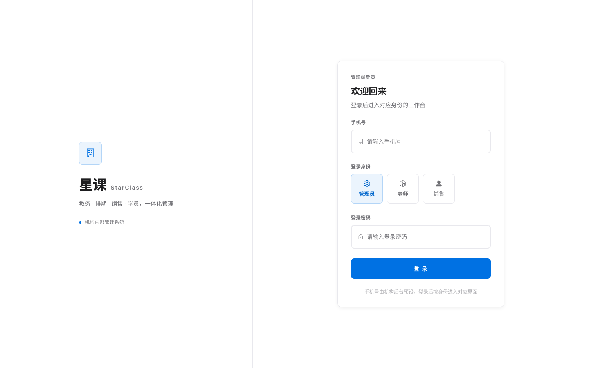
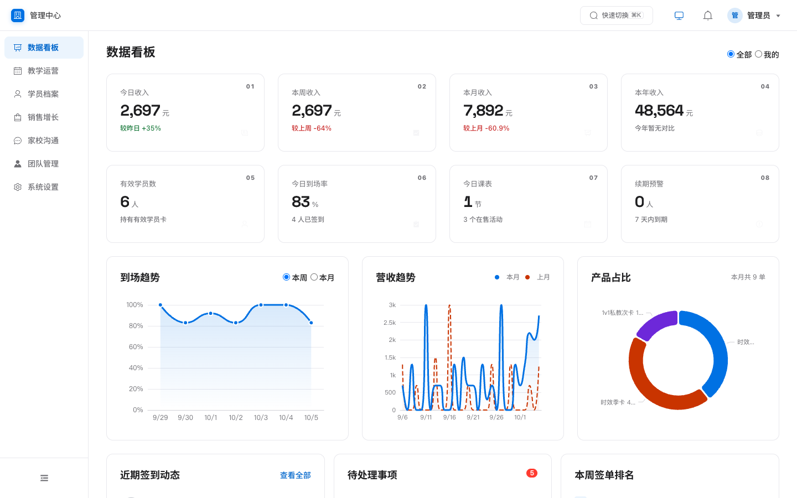
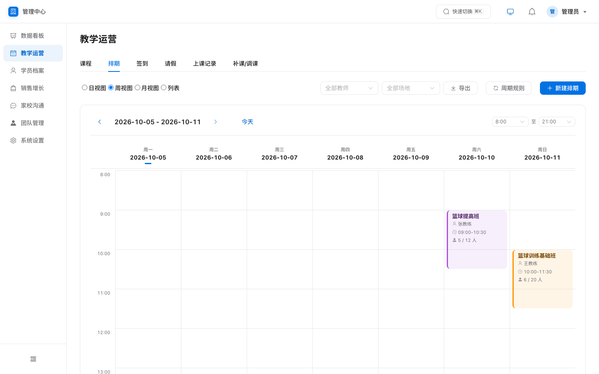
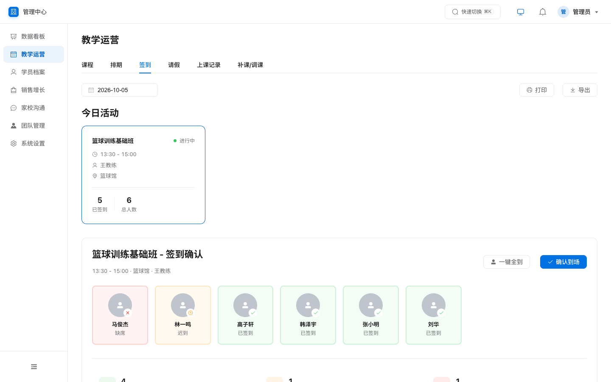
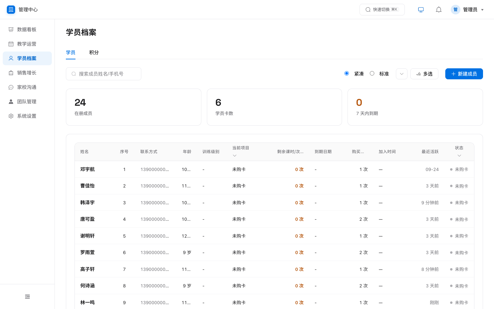
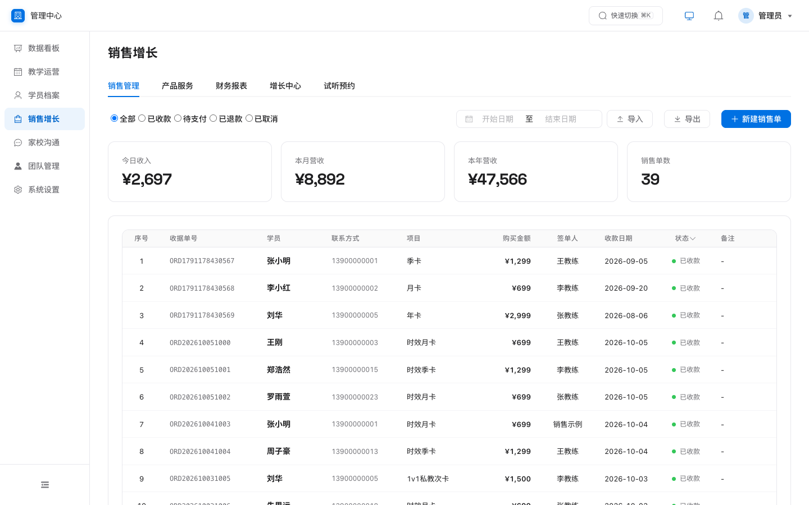
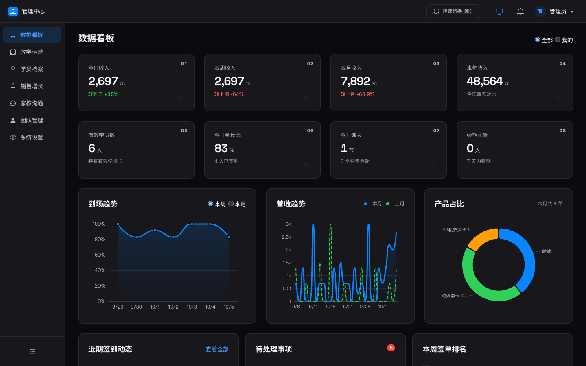
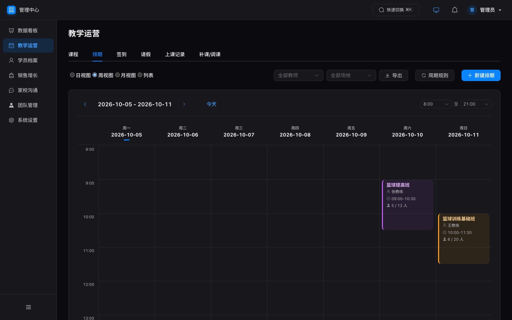

# 星课 StarClass · 教培 / 健身机构一体化管理系统

[](https://github.com/Hoodas101/starclass/actions/workflows/ci.yml)
[](LICENSE)

[🇨🇳 中文](#星课-starclass--教培--健身机构一体化管理系统) · [🇬🇧 English](#english)

> **如果你开着一家培训机构**：这套系统一次性部署在**你自己的电脑或服务器**上，
> 不用每年交 SaaS 年费（同类系统 ¥499–2,099 / 年），不限学员人数，
> 学员和家长数据全部留在自己机器里，员工离职也带不走。

> 专为小型与个人教培机构打造的一体化教务产品：**Web 管理后台 + API 后端**，覆盖招生、排课、考勤、家校沟通、销售、续费、薪资结算全流程。克隆即可在自己电脑或服务器一键部署；可选付费扩展提供家长 / 教练 / 管理三端微信小程序。

**零云服务依赖 · 数据完全归属机构 · clone 后一条命令跑起来**

---

## 🚀 一键部署（2 分钟上手）

**方式 A · 想先看效果（灌入演示数据）**

```bash
git clone https://github.com/Hoodas101/starclass.git
cd starclass
SEED_DEMO_DATA=1 bash deploy.sh     # ← 必须带这个变量，才会生成演示数据
```

打开 http://localhost:3001，用 **`13800000001` / `123456`** 登录。

**方式 B · 正式使用（推荐，安全默认）**

```bash
git clone https://github.com/Hoodas101/starclass.git
cd starclass
bash deploy.sh
```

> ⚠️ **不带 `SEED_DEMO_DATA=1` 时不会写入任何演示数据**，脚本只创建一个管理员账号，
> **口令由系统随机生成、仅在终端打印这一次**，请立即复制保存。

**方式 C · 部署到云服务器（Docker）**

```bash
git clone https://github.com/Hoodas101/starclass.git
cd starclass
./deploy/deploy.sh --host app.yourdomain.com   # 自动 HTTPS；内网用 --no-https
```

单容器交付（API + 管理后台同端口），SQLite 在数据卷中跨升级保留。
也可在 GitHub Actions 里点 **Deploy → Run workflow** 完成全自动部署，
详见 [`deploy/README.md`](deploy/README.md)。

三种方式完成后打开：

| 服务 | 地址 | 说明 |
|---|---|---|
| 🖥️ 管理后台 | http://localhost:3001 | 后端同端口托管，单入口 |
| ⚙️ 后端 API | http://localhost:3001/api | 健康检查 `/api/health` |

**演示账号**（仅方式 A 会生成）：

| 身份 | 手机号 | 密码 | 入口 |
|---|---|---|---|
| 管理员 | `13800000001` | `123456` | Web 管理后台（工作台） |
| 教练 / 家长 | `13800000011`（王教练）、`13900000001`（小明爸爸）等 | `123456` / 无需密码 | 数据 API；可选付费三端小程序（见下文） |

> 上线前务必修改默认密码（管理后台 → 系统设置 → 账号安全）。
> 方式 B / C 创建的管理员账号为随机口令，请以部署脚本终端输出为准。

### 常用命令

```bash
bash deploy.sh        # 一键部署 / 重新部署（已有数据不会被动）
bash start-all.sh     # 日常启动（依赖/构建产物已就绪时更快）
bash stop-all.sh      # 停止服务
npm test              # 全部后端回归（34 套专项 + 256 项全功能，隔离测试库）
npm run smoke         # 冒烟测试（39 项，需服务运行中）
npm run test:backend  # 仅全功能套件（257 项 = 256 断言 + 1 预期 WARN，隔离库自动快照/夹具两模式）
npm run verify        # 扩展验收套件（约 20 套件，需服务运行中，见 TEST-GUIDE.md）
```

### 生产环境必读

```bash
export JWT_SECRET=$(openssl rand -hex 32)   # 建议显式设置；未设置时系统会自动生成随机密钥并持久化
```

> 未设置 `JWT_SECRET` 也能安全运行（首次启动自动生成强随机密钥存于 `backend/db/.jwt-secret`，随数据库一起备份）。仅当你多实例部署或需要密钥可控时，才显式导出共享密钥。

正式上线（公网服务器 + HTTPS 域名 + 数据备份）完整步骤见 **[`部署上线说明.md`](部署上线说明.md)**。

---

## ✨ 功能总览（Web 工作台）

- **数据看板**：今日/本周/本月/本年收入、签单排名、到场率、续期预警
- **排课**：周视图 / 列表、重复规则（每天/每周/按 N 天）、冲突检测、公开活动报名、补课 / 调课
- **考勤**：一键点名、签到统计、缺席自动通知家长（迟到计积分）
- **成员**：学员 / 家长档案、会员卡暂停 / 恢复（按暂停天数顺延）、多孩家庭绑定、续费提醒（15/7/1 天可配）
- **家校沟通**：站内通知下发、反馈回复闭环、成长记录（教练课后点评）
- **销售**：签单开卡自动激活权益、批量导入、自定义退费、财务汇总
- **薪资**：课时 / 人头 / 混合计费，课时费规则可视化配置
- **可定制**：机构称呼自定义（老师/学员/会员…全站替换）、表格字段配置、积分 / 退费 / 请假规则全部可配
- 🌙 **深色模式**：跟随系统 / 浅色 / 深色三档切换

### 💰 可选付费扩展：三端微信小程序

家长端 / 教练端 / 管理员端原生小程序（41 页）不随本仓库发布，作为商业扩展单独提供：
会员身份卡与报名、扫码签到、请假补课、积分商城、订单、成长档案、课后点评、订阅消息提醒（开课/续费/余额）。
后端 API 已为小程序预留微信登录、支付与订阅消息能力，购买部署授权后即可对接你自己的小程序。

**也可以只买服务、不买小程序**：如果你想把 Web 管理后台跑起来并教会员工用，
选择「部署 + 培训服务」即可，不影响后续自行升级。

<!-- TODO(维护者)：把下面一行换成你的实际联系方式（企业微信活码 / 表单链接 / 报价页）。
     建议明码标价：可挡掉大量"多少钱"的重复咨询。 -->
👉 咨询方式：在本仓库 [Issues](https://github.com/Hoodas101/starclass/issues) 留言（中文即可）。

---

## 🧱 技术架构

```
┌─────────────────────────────────────────────────┐
│  Express 后端（Node.js）                          │
│  23 组路由 · JWT 鉴权 · bcrypt 密码 · 角色门控      │
│  自动备份 · 迁移系统（幂等）· 限流                   │
├─────────────────────────────────────────────────┤
│  SQLite（better-sqlite3, WAL）                    │
│  单文件数据库 · 数据完全归属机构                     │
└──────────────────┬──────────────────────────────┘
                   │ 同端口静态托管
┌──────────────────▼──────────────────────────────┐
│  Web 管理后台（Vue3 + Element Plus + Vite）       │
│  首页工作台 · 7 大业务模块 · 单入口 :3001           │
│  深色模式 · 浅色 / 深色 / 跟随系统                  │
└─────────────────────────────────────────────────┘
   （可选付费扩展：家长 / 教练 / 管理三端微信小程序，
     经 HTTPS + Bearer Token 对接上述后端 API）
```

> **质量声明**：34 套自动化回归测试（支付幂等 / 退款回收 / 跨角色越权 / 审计留痕 / 口径一致性）
> + CI 在 Node 18 / 20 / 22 三个版本全绿 + 部署前自动备份与健康检查。
> 改代码后跑 `npm test` 即可复现全部结果。管理端共 23 个页面视图，覆盖 7 大业务模块。

| 端 | 技术栈 | 位置 |
|---|---|---|
| 后端 | Node.js + Express + better-sqlite3 | `backend/` |
| Web 管理端 | Vue3 + Element Plus + ECharts + Vite | `web-admin/` |

**运行成本为零**：无云服务、无数据库服务、无消息队列，一台 1 核 2G 云服务器或一台旧笔记本即可长期运行。

---

## 📸 界面预览

**浅色模式**

| 登录 | 数据看板 | 排课管理 |
|---|---|---|
|  |  |  |

| 点名签到 | 成员档案 | 订单管理 |
|---|---|---|
|  |  |  |

**🌙 深色模式**（跟随系统 / 浅色 / 深色三档切换）

| 数据看板 | 排课管理 |
|---|---|
|  |  |

更多截图（班级 / 请假 / 积分 / 增长 / 通知 / 反馈 / 员工 / 教练课时 / 设置）见 [`docs/screenshots/`](docs/screenshots/)。

---

## 🛠 长期稳定运行（运维三件事）

```bash
# 1. 备份 —— 数据全在单文件 backend/db/data.db（每日自动备份在 backend/backups/，Web 端可一键下载）
sqlite3 backend/db/data.db ".backup 'backup-$(date +%F).db'"

# 2. 升级 —— 拉新代码后重跑一键部署（不会动你的数据）
git pull && bash deploy.sh

# 3. 看日志 / 健康检查
tail -50 backend.log
curl http://localhost:3001/api/health
```

服务器 7×24 运行推荐用 pm2 守护：`npm i -g pm2 && cd backend && pm2 start server.js --name starclass && pm2 save`。完整公网部署（域名 / HTTPS）见 [`部署上线说明.md`](部署上线说明.md)。

---

## ❓ 常见问题（FAQ 速查）

| 问题 | 答案 |
|---|---|
| Node 版本要求？ | **>= 18**（推荐 20/22）。装好后再跑 `bash deploy.sh` |
| 依赖安装报错 / better-sqlite3 编译失败？ | 缺编译环境：macOS 执行 `xcode-select --install`；Linux 执行 `apt install build-essential python3` |
| 端口 3001 被占用？ | 先 `bash stop-all.sh`；仍占用则 `export PORT=3002 && bash start-all.sh` |
| 忘记管理员密码？ | 执行 `node backend/db/create-admin.js` 重置（可指定 `--phone` / `--password`，不指定则生成随机强口令并打印一次）。**切勿用 `npm run seed` 重置**——seed 会先清空全部业务表再写入示例数据，真实数据将不可恢复 |
| 想清空示例数据正式使用？ | 管理后台逐个删除演示学员/订单即可，或删 `backend/db/data.db*` 后只跑 `npm run init:db`（不 seed）从零录入 |
| 换电脑 / 迁移服务器？ | 先 `bash tools/backup.sh` 生成一致性快照，再拷走快照 + `backend/uploads/`，新机重跑 `bash deploy.sh` 后放回。**WAL 模式下直接 `cp backend/db/data.db` 会丢掉尚未 checkpoint 的最近写入** |
| 三端小程序怎么获取？ | 家长 / 教练 / 管理端小程序为付费商业扩展，不在本仓库内；在 Issues 留言联系获取部署授权 |
| 不配微信小程序能用吗？ | 能。Web 工作台手机号 + 密码登录全功能可用；后端预留 `WX_APPID`/`WX_SECRET` 供小程序扩展对接 |

完整排障表 + 各角色操作说明见 **[`docs/常见问题FAQ.md`](docs/常见问题FAQ.md)** 与 **[`使用手册.md`](使用手册.md)**。

---

## 📖 文档

| 文档 | 内容 |
|---|---|
| [`使用手册.md`](使用手册.md) | 各角色日常操作说明（招生 → 排课 → 考勤 → 续费全流程） |
| [`docs/常见问题FAQ.md`](docs/常见问题FAQ.md) | 安装 / 使用 / 迁移 / 排障 全量问答 |
| [`部署上线说明.md`](部署上线说明.md) | 公网部署、HTTPS、合法域名、数据备份 |
| [`deploy/README.md`](deploy/README.md) | Docker 一键部署（含 GitHub Actions 点一下部署） |
| [`TEST-GUIDE.md`](TEST-GUIDE.md) | 改代码后的验证与回归门禁 |
| [`DESIGN.md`](DESIGN.md) | 设计系统规范（色彩 / 字体 / 组件 / 间距，含深浅色 token） |
| [`CONTRIBUTING.md`](CONTRIBUTING.md) · [`SECURITY.md`](SECURITY.md) · [`CHANGELOG.md`](CHANGELOG.md) | 贡献指南 / 漏洞报告 / 版本记录 |

---

## 🔒 安全设计

- JWT 鉴权 + 角色门控，家长 / 教练 / 管理员数据严格隔离
- 密码 bcrypt 存储；资金操作（订单导入 / 积分消耗 / 退款 / 审批）全部事务化
- `JWT_SECRET` 未配置时自动生成随机密钥持久化，绝不使用硬编码默认值
- 登录限流 100 次 / 15 分钟，全局限流 600 次 / 分钟
- 每日自动备份（`backend/backups/`），Web 端支持一键备份下载

---

## 打赏支持

如果这个项目对你有帮助，欢迎请作者喝杯咖啡 —— 每一杯都是持续更新的动力 ☕

<p align="center">
  &nbsp;&nbsp;
  
</p>

**中国大陆以外？** 这两个码需要绑定大陆银行卡的微信 / 支付宝，海外朋友多半扫不了。
国际支付通道（信用卡 / PayPal）正在接入；在那之前，点个 ⭐ Star 或提个 Issue，
对项目的帮助比想象中大。
## 🇬🇧 English

StarClass is a self-hosted management system for small training and fitness studios: enrollment, scheduling, attendance, parent communication, renewals, points and payroll — in one app. A Vue 3 admin console on top of an Express API, with all data in a single SQLite file. No cloud services, no subscriptions.

```bash
git clone https://github.com/Hoodas101/starclass.git
cd starclass && SEED_DEMO_DATA=1 bash deploy.sh   # deps + demo data + build + start
```

Open http://localhost:3001 — demo admin login `13800000001` / `123456`.
Without `SEED_DEMO_DATA=1` the script creates a single admin with a **random password
printed once**, and seeds no demo data.
For a public server: `./deploy/deploy.sh --host app.yourdomain.com` (Docker, auto HTTPS).
The rest of this README and the admin UI are in Chinese.

[⬆ 返回中文](#星课-starclass--教培--健身机构一体化管理系统)

---

## 📝 License

MIT
